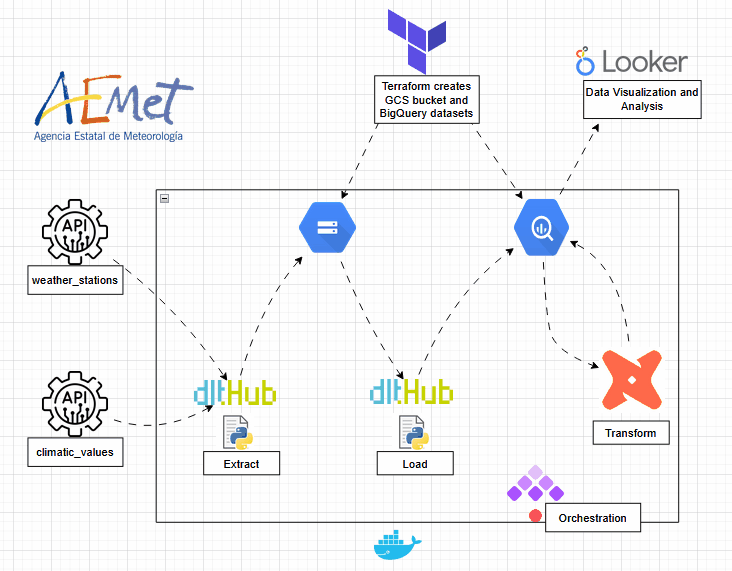

# AEMET ELT



## Table of Contents
1. [Problem statement](#problem-statement)
2. [Project solution](#project-solution)
3. [Tech Stack](#tech-stack)
4. [Prerequisites](#prerequisites)
5. [Datasets](#datasets)
6. [Usage](#usage)
7. [Orchestration](#orchestration)
8. [Visualization](#visualization)

## Problem Statement

Spain has over 900 meteorological stations across the country that collect valuable weather data. However, accessing and processing this data in a structured manner can be a challenging task, especially when trying to analyze it over different time periods or extract meaningful statistics from it.

## Project Solution

This project leverages the open data APIs provided by [AEMET (Agencia Estatal de Meteorología)](https://opendata.aemet.es/dist/index.html) to collect historical weather data from meteorological stations. The system gathers data on a yearly basis and processes it to generate detailed statistics on weather measurements (e.g., temperature, humidity, etc.) and the geographical locations of the stations. This approach allows users to easily analyze weather trends, compare station data, and gain insights into the meteorological conditions across the country.

## Tech Stack

- **BigQuery**: Data Warehouse.
- **Google Cloud Storage**: Storage.
- **Docker**: Containerization.
- **Terraform**: Infrastructure as Code.
- **Kestra**: Orchestration.
- **dlt**: Data Loading tool.
- **dbt**: Data Transformation tool.
- **Looker Studio**: Data visualization.

## Prerequisites

Ensure you have the following installed and configured:

- A Google Cloud Project with a Service Account and its associated key.
- Docker Desktop
- Terraform

## Datasets

AEMET provides open data APIs to access meteorological data for Spain, including climate values and weather station information. You can explore the available APIs [here](https://opendata.aemet.es/dist/index.html?).

To use these APIs, you can obtain a free API key by registering here:  
[Get your free API Key](https://opendata.aemet.es/centrodedescargas/altaUsuario)

### API Data Sources

- **Weather Stations Resource**:  
  This resource provides information about meteorological stations, including their province, name, and unique identifier (indicativo). Details can be found [here](https://opendata.aemet.es/opendata/sh/0556af7a).

- **Climate Values Resource**:  
  This resource offers various climate-related values, including temperature, humidity, and other weather measurements across different time periods. Details can be found [here](https://opendata.aemet.es/opendata/sh/b3aa9d28).

## Usage

### 1. Setting Up Infrastructure with Terraform

```sh
cd terraform
terraform init
terraform plan -var="project=projectId"
terraform apply -var="project=projectId"
```

For more detailed explanations and expected outputs, refer to the [Terraform README](terraform/README.md).

### 2. Orchestration with Kestra
Navigate to the Kestra directory and start the service:
```sh
cd ../ketra
docker compose up -d
```
Once running, Kestra should be accessible at http://localhost:8080.


