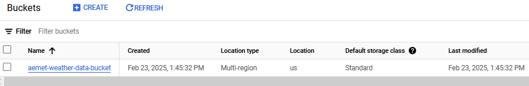
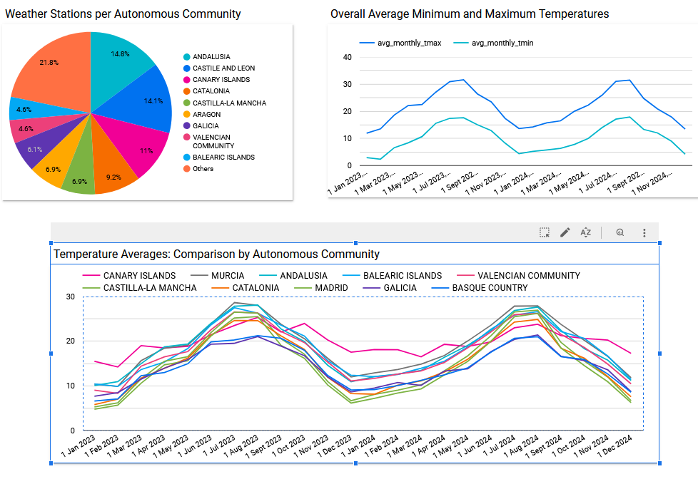

# AEMET ELT


## Table of Contents
1. [Problem statement](#problem-statement)
2. [Project solution](#project-solution)
3. [Tech Stack](#tech-stack)
4. [Prerequisites](#prerequisites)
5. [Datasets](#datasets)
6. [Usage](#usage)
7. [Visualization](#visualization)

## Problem Statement

Spain has over 900 meteorological stations across the country that collect valuable weather data. However, accessing and processing this data in a structured manner can be a challenging task, especially when trying to analyze it over different time periods or extract meaningful statistics from it.

## Project Solution

This project leverages the open data APIs provided by [AEMET (Agencia Estatal de Meteorología)](https://opendata.aemet.es/dist/index.html) to collect historical weather data from meteorological stations. The system gathers data for a specific year and processes it to generate detailed statistics on weather measurements (e.g., temperature, humidity, etc.) and the geographical locations of the stations. This approach allows users to easily analyze weather trends, compare station data, and gain insights into the meteorological conditions across the country.

## Tech Stack

- **BigQuery**: Data Warehouse.
- **Google Cloud Storage**: Object storage service.
- **Docker**: Containerization.
- **Terraform**: Infrastructure as Code.
- **Kestra**: Orchestration.
- **dlt**: Data Loading tool.
- **dbt**: Data Transformation tool.
- **Looker Studio**: Data visualization.

## Prerequisites

Ensure you have the following installed and configured:

- A **Google Cloud Project** with a Service Account and its associated key.
- **Docker Desktop** for containerization.
- **Terraform** for infrastructure provisioning.

## Datasets

AEMET provides [open data APIs](https://opendata.aemet.es/dist/index.html?) to access meteorological data for Spain, including climate values and weather station information.

To use these APIs, you can obtain a free API key by registering [here](https://opendata.aemet.es/centrodedescargas/altaUsuario).


### API Data Sources

- **[Weather Stations](https://opendata.aemet.es/opendata/sh/0556af7a)**:  
  This resource provides information about meteorological stations, including their province, name, and unique identifier (indicativo).

- **[Climate Values](https://opendata.aemet.es/opendata/sh/b3aa9d28)**:  
  This resource offers various climate-related values, including temperature, humidity, and other weather measurements across different time periods.

## Usage

### 1. Setting Up Infrastructure with Terraform

Before setting up the infrastructure, you must create a **Service Account** with the necessary permissions to manage resources in Google Cloud Platform. The Service Account should have the following permissions:

Once the Service Account is created, ensure you download the **JSON key** and configure it in your environment to authenticate Terraform with GCP.

After that, you can proceed with the following steps to set up the infrastructure:

```sh
cd terraform
terraform init
terraform plan -var="project=projectId"
terraform apply -var="project=projectId"
```

After running this, Terraform will create:
* A GCS bucket to store the data.


* Two BigQuery datasets: one for raw data and another for transformed data.


For more detailed explanations and expected outputs, refer to the [Terraform README](terraform/README.md).

### 2. Orchestration with Kestra

#### 🔹 **Flow Details**

- **`extract_weather_data.yaml`**: Extracts all data from the **weather_stations** and **climatic_value** tables using **dlt**. The data is stored in **GCS** in **Parquet** format.

- **`load_gcp_kv.yaml`**: Sets up the necessary **key-value pairs** in the namespace for the Kestra flows.

- **`load_weather_data.yaml`**: Loads all **Parquet files** into the corresponding **BigQuery datasets**.

- **`master_flow.yaml`**: Orchestrates the **extract**, **transform**, and **load** flows in sequence for a specified year.

- **`transform_dbt.yaml`**: Applies **dbt** to transform the data for analytical purposes.

#### **Instructions**

* Step 1: Navigate to the Kestra directory and start the service:
```sh
cd ../ketra
docker compose up -d
```
Once running, Kestra should be accessible at http://localhost:8080.

* Step 2: Go to flows and import all the kestra/flows/*.yaml files


* Step 3: Edit the load_gcp_kv.yaml file with the GCP and AEMET keys, then execute it. The aemetelt key store should contain the following:


* Step 4: Navigate to the master_flow and execute it. You will be prompted to input a year.


Once the execution finishes successfully...


You will have the Parquet files for the specified year stored in GCS:


Additionally, the BigQuery datasets will be populated:


* climatic_values is partitioned by ano and clustered by indicativo


* weather_stations is clustered by provincia


#### Re-executing for a different year

Re-running the flow for another year will append the data in GCS and replace the tables in BigQuery, ensuring all existing data is reloaded.

## Visualization

I used Looker Studio to visualize various statistics, including:

- The distribution of weather stations across autonomous communities in Spain.
- Averages, minimums, and maximum temperatures recorded by these stations.

Below is a snapshot of the dashboard:



