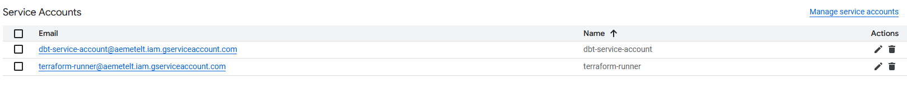
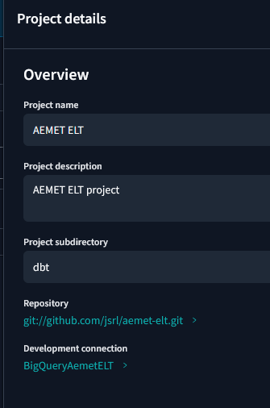
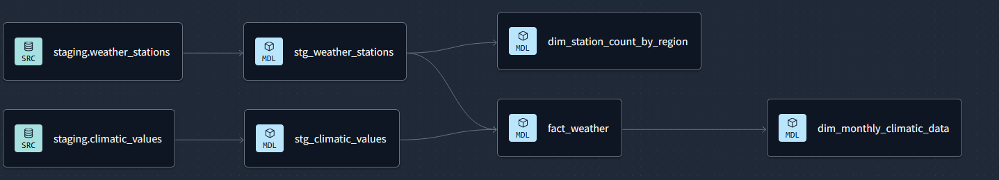
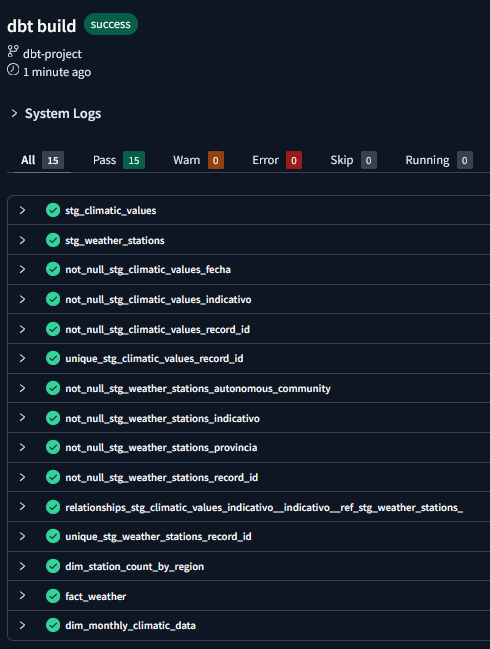

## Introduction to dbt

[dbt](https://www.getdbt.com/) (Data Build Tool) is an open-source command-line tool that enables data analysts and engineers to transform raw data into clean, structured datasets. It allows users to define transformations in SQL, test data quality, and manage dependencies between datasets, making it a core tool for modern data workflows.

Key features of **dbt** include:

- **SQL-Based Transformations**: Write SQL queries to transform raw data into analytics-ready models, which can be easily versioned and maintained.
- **Data Testing and Quality Assurance**: dbt includes built-in capabilities for testing data quality and integrity, ensuring that your data pipelines are reliable.
- **Model Dependency Management**: dbt automatically handles dependencies between models, ensuring that they are executed in the correct order.
- **Version Control Integration**: dbt works seamlessly with Git, allowing for collaboration and version control on your data transformation scripts.
- **Modular and Scalable**: dbt's modular approach lets you build reusable data models that can scale with your project needs.

## dbt Configuration

To configure **dbt** to work with BigQuery, you need to create a **service account** with the necessary permissions for accessing BigQuery.

### Steps to Set Up the Service Account:

1. **Create a Service Account**:  
   Go to the Google Cloud Console and create a new service account. This service account will be used by **dbt** to authenticate and interact with BigQuery.

2. **Assign BigQuery Permissions**:  
   Assign the appropriate permissions to the service account to ensure it can read and write to BigQuery datasets. At a minimum, the service account should have the following roles:
   - `roles/bigquery.dataEditor` (Allows the service account to create and update tables in BigQuery)
   - `roles/bigquery.user` (Allows the service account to query BigQuery datasets)

   

   > **Note**: The permissions outlined here (such as **BigQuery Admin**) are broad and intended for development purposes. In a production environment, it is recommended to follow the principle of least privilege by granting more restricted permissions that only allow the necessary actions. This helps to minimize security risks and ensure a more secure environment.
   
3. **Download the Service Account Key**:  
   Once the service account is created, download the JSON key file, which will be used to authenticate dbt.

4. **Set Up dbt Credentials**:  
   Store the JSON key file in a secure location. Then configure the BigQuery connection , ensuring that the connection uses the service account key for authentication. Additionally, attach your GitHub repository to this connection to enable seamless version control and collaboration.

   

## AEMETELT Model

The following is the **dbt** model for the AEMETELT project:



### Expected dbt Build Result

After running `dbt build`, the expected result will look as follows:




### Resources:
- Learn more about dbt [in the docs](https://docs.getdbt.com/docs/introduction)
- Check out [Discourse](https://discourse.getdbt.com/) for commonly asked questions and answers
- Join the [dbt community](https://getdbt.com/community) to learn from other analytics engineers
- Find [dbt events](https://events.getdbt.com) near you
- Check out [the blog](https://blog.getdbt.com/) for the latest news on dbt's development and best practices


### Macro for generating dbt models (code and compile)
```sh

{{ codegen.generate_model_yaml(
    model_names = models_to_generate
) }}



{{ codegen.generate_model_yaml(
    model_names = models_to_generate
) }}
```