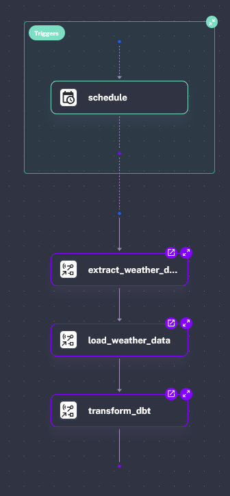

## Introduction to Kestra

Kestra is an open-source, highly scalable, and flexible data orchestration platform designed to manage and automate the complex workflows of data pipelines. It supports a wide variety of sources, destinations, and transformations, making it a powerful tool for building robust ELT (Extract, Load, Transform) processes. With its extensible plugin system, Kestra enables seamless integration with many modern data tools and platforms, allowing data engineers to efficiently manage data flows and automate data processing tasks.

Kestra's strengths include its user-friendly interface for monitoring, easy integration with other tools, and high availability for production-grade workloads. It is ideal for orchestrating data workflows across multiple environments, ensuring scalability and reliability.

## Aemetelt topology

