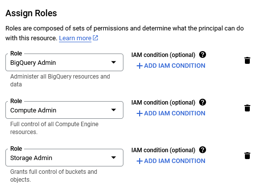
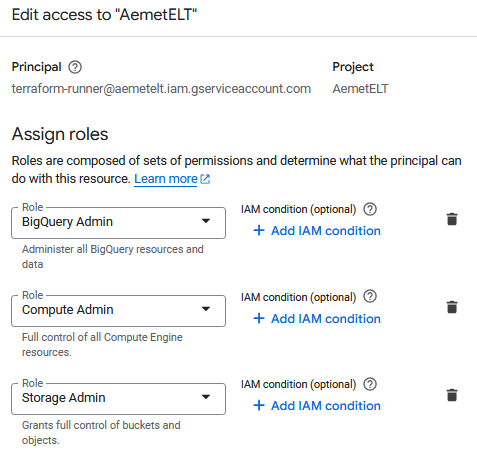

# Using Terraform with Google Cloud Platform

## Key Terraform Commands
1. **`terraform init`**: Initializes the Terraform project and downloads the required providers.
2. **`terraform plan`**: Previews the changes Terraform will apply.
3. **`terraform apply`**: Executes the plan and applies the changes defined in the configuration files.
4. **`terraform destroy`**: Removes all resources defined in the configuration files.

### Additional Commands
- **Format Terraform files:**
  ```bash
  terraform fmt
  ```

## Service Account

The service account created for this project is the following:



This account has been assigned the following permissions:



> **Note**: The permissions outlined here (such as **Storage Admin** or **BigQuery Admin**) are broad and intended for development purposes. In a production environment, it is recommended to follow the principle of least privilege by granting more restricted permissions that only allow the necessary actions. This helps to minimize security risks and ensure a more secure environment.


## Authentication
1. Authenticate with Google Cloud:
   ```bash
   gcloud auth application-default login
   ```
2. Set the `GOOGLE_APPLICATION_CREDENTIALS` environment variable to the path of your service account key file:
   ```bash
   export GOOGLE_APPLICATION_CREDENTIALS="/path/to/your/key.json"
   ```

### Commands for creating the infrastructure
```bash
terraform plan -var="project=XXXXXXXX-XXXXXX"
terraform apply -var="project=XXXXXXXX-XXXXXX"
terraform destroy -var="project=XXXXXXXX-XXXXXX"
```

### Expected outputs
```sh
Terraform has been successfully initialized!

Plan: 3 to add, 0 to change, 0 to destroy.

Apply complete! Resources: 3 added, 0 changed, 0 destroyed.
```


### Check data types from BigQuery

It is useful to run a query against the external table in BigQuery to check the data types of the newly created Parquet files before loading them into BigQuery. This allows you to verify the structure and ensure that the data is correctly formatted.


```sql
CREATE EXTERNAL TABLE `weather_dataset.test`
OPTIONS (
  format = 'PARQUET',
  uris = ['gs://aemet-weather-data-bucket/climatic_values/climatic_values/*.parquet']
);

SELECT column_name, data_type 
FROM `weather_dataset.INFORMATION_SCHEMA.COLUMNS`
WHERE table_name = 'test';
```
This query will give you the data types of the columns in the Parquet files, which is helpful to ensure compatibility and avoid any potential issues when importing the data into BigQuery.